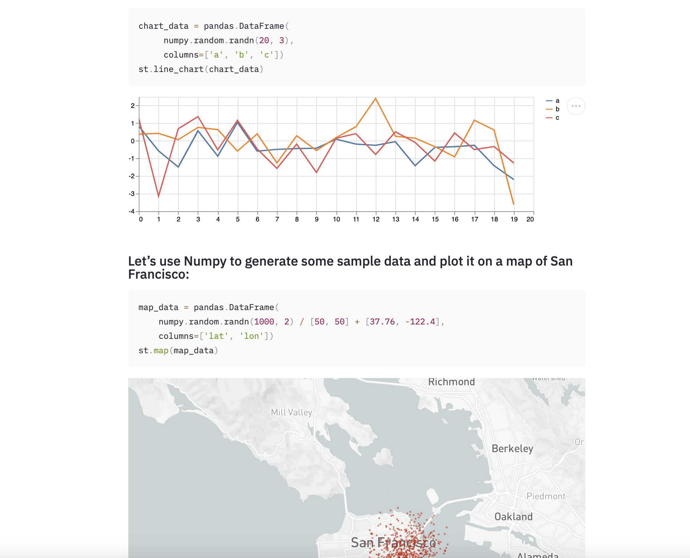

# Streamlit on Docker の丸コピー
- https://github.com/MrTomerLevi/streamlit-docker
- ※Virtual Box使ってる場合は8501ポート開けとく必要がある（設定→ネットワーク→高度→ポートフォワーディング）

# Streamlit: pythonアプリ作るフレームワーク
- テキストボックスやボタン動作だけの簡単なWEBアプリを作成した公開したいときや、ちょっとした社内ツールをWEBで実現したいときに使える
- アプリの見た目はコードいじれないjupyter
- python版のshinyという認識でよさそう
- ファイルダウンロードやログイン制御はできないのでその場合はFlask使おう
- Project docs: https://streamlit.io/docs/

<p align="center">
  
</p>

Docker imageはDocker Hubのをつかう: 
## Pull
`docker pull tomerlevi/streamlit-docker`

*Page: https://cloud.docker.com/u/tomerlevi/repository/docker/tomerlevi/streamlit-docker

## このDockerのBuild 方法（すでにDocker imageあるなら不要）
- `requirements.txt`にpipで追加したいpythonパッケージ書いとけば起動時にインストールする
```bash
Docker Quickstart Terminal開いて
$ cd ../../Users/81908/jupyter_notebook/Dockerfiles/streamlit/
$ docker build -t tomerlevi/streamlit-docker -f Dockerfile .  # Docker image作成する
```

## streamlit scriptのサンプル実行
- いずれか実行したら、http://localhost:8501 でいじれる
- $ Ctrl + c でコンテナ停止
```bash
$ docker run --rm -it -p 8501:8501 tomerlevi/streamlit-docker /examples/intro.py
$ docker run --rm -it -p 8501:8501 tomerlevi/streamlit-docker /examples/plot_example.py
$ docker run --rm -it -p 8501:8501 tomerlevi/streamlit-docker /examples/uber_nyc_data_explorer.py
```

## ローカル(srcディレクトリ)の streamlit script 動かす
```bash
$ docker run -p 8501:8501 -it -m 8g -v $PWD:/app --rm --entrypoint /bin/bash tomerlevi/streamlit-docker  # コンテナ起動してbashで入る
$ streamlit run src/intro.py
$ streamlit run src/my_test_coronavirus_trend.py
スクリプト編集してブラウザ更新すると、即変更反映される
```

## GitHubに上がっている streamlit script をローカルクローン無しで実行
- 参考: https://qiita.com/prs-watch/items/ca5589a725c479e8c489
```bash
$ docker run -p 8501:8501 -it -m 8g -v $PWD:/app --rm --entrypoint /bin/bash tomerlevi/streamlit-docker  # コンテナ起動してbashで入る
$ streamlit run https://raw.githubusercontent.com/prs-watch/streamlit-sample/master/sample.py
```
